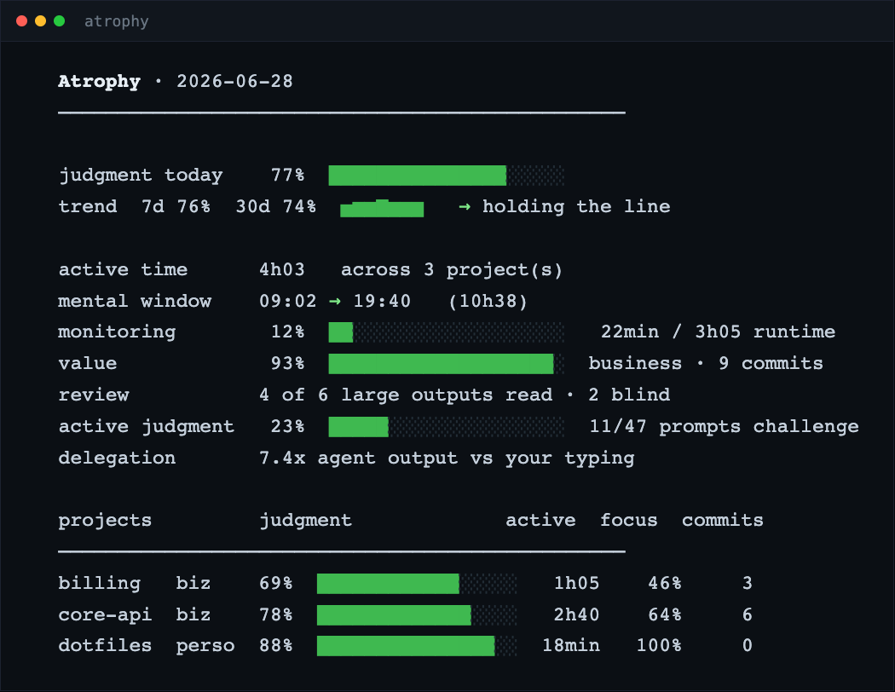

# atrophy

**A local, private macOS tool that mirrors your judgment vs autopilot when coding with AI agents. Built for developers wary of AI over-reliance, cognitive offloading, and the slow erosion of critical thinking.**

> **Offload the work, never the judgment.**

[](LICENSE)
[](#requirements)
[](https://github.com/michel-is-coding/atrophy/actions/workflows/ci.yml)
[](#privacy)

atrophy reads your own Claude Code transcripts (aggregates only) and shows, in one nightly report, whether you are exercising judgment or running on autopilot with AI coding agents. It does not think for you: you decide.

## What you'll see
One glanceable report, aggregates only. Project names below are placeholders (`core-api`, `billing`, `dotfiles`), the numbers are illustrative:



Renders in your terminal from your own data: no dashboard, no upload. The numbers are illustrative; your own report reflects your own activity.

<details>
<summary>Show the same report as text</summary>

```
  Atrophy · 2026-06-28
  ────────────────────────────────────────────────

  judgment today    77%  ███████████████░░░░░
  trend  7d 76%  30d 74%  ▅▆▆▇▆▆▆   → holding the line

  active time      4h03   across 3 project(s)
  mental window    09:02 → 19:40   (10h38)
  monitoring        12%  ██░░░░░░░░░░░░░░░░░░   22min / 3h05 runtime
  value             93%  ███████████████████░  business · 9 commits
  review           4 of 6 large outputs read · 2 blind
  active judgment   23%  █████░░░░░░░░░░░░░░░  11/47 prompts challenge
  delegation       7.4x agent output vs your typing

  projects         judgment             active  focus  commits
  ────────────────────────────────────────────────
  billing   biz    69%  ████████████░░░░░   1h05    46%     3
  core-api  biz    78%  █████████████░░░░   2h40    64%     6
  dotfiles  perso  88%  ███████████████░░  18min   100%     0
```

</details>

**What it is, and what it is not.**

| ✅ atrophy is | ❌ atrophy is not |
| --- | --- |
| a private mirror of your judgment | a productivity score to maximize |
| local, aggregates only | a tracker that uploads your prompts or code |
| a silent nightly signal | a time tracker or always-on dashboard (RescueTime, WakaTime, ActivityWatch) |
| an indicator you interpret | a verdict, or a moralizing nag |
| meant to be outgrown | a crutch to optimize and keep forever |

**Same data, different question.** Other tools read the same `~/.claude/projects` transcripts to track your token spend (ccusage, Claude-Code-Usage-Monitor). atrophy reads them to track your judgment instead.

Jump to: [Install](#install) · [Daily use](#daily-use) · [Design principles](#design-principles) · [Why judgment atrophies](#why-judgment-atrophies) · [Privacy](#privacy)

## Contents
- [What you'll see](#what-youll-see)
- [Requirements](#requirements)
- [Install](#install)
- [Daily use](#daily-use)
- [Design principles](#design-principles)
- [Why judgment atrophies](#why-judgment-atrophies)
- [Config](#config-optional)
- [Optional LLM](#optional-llm)
- [Privacy](#privacy)
- [Uninstall](#uninstall)
- [Limitations](#limitations-and-honest-caveats)
- [Contributing](#contributing)
- [Further reading](#further-reading)

## Requirements
- macOS, Python 3.9+ (system).

## Install
The installer touches only your own machine: it creates `~/.atrophy/` and registers 3 launchd agents under your user account, nothing more. Read `install.sh` first if you want to see exactly what it does.

```bash
git clone https://github.com/michel-is-coding/atrophy.git ~/code/atrophy
# (or via SSH: git clone git@github.com:michel-is-coding/atrophy.git ~/code/atrophy)
cd ~/code/atrophy && ./install.sh
```

The 3 agents handle presence every 60s, the end-of-day report at 23:30, and an hourly guardrail. At the end the installer shows, **optionally**, how to enable the local LLM lens.

Next step: just work as usual. Your first report appears tonight at 23:30, or run it now with `python3 ~/code/atrophy/atrophy.py`.

## Daily use
- **In the evening**, a 1-to-5 rating "judgment exercised today?", a single integer: `~/code/atrophy/bin/atrophy-rate.sh 4` (editable; the evening report also prompts you).
- **Report on demand**: `python3 ~/code/atrophy/atrophy.py` (or `cat ~/.atrophy/last.txt`).
- **Silent except alert**: you are only notified when a threshold is crossed (judgment dropping, boundary-less day, more than ~10h active).

## Design principles
- **Mirror, not judge.** Goodhart's law: "when a measure becomes a target, it ceases to be a good measure." The tool stays silent and celebrates judgment exercised.
- **The scarce asset is judgment, not time.** Delegating execution is healthy; delegating strategic judgment sells off the asset that actually creates value.
- **Feeling productive is not producing.** Hence the value axis (business %, commits): 18 hours of agent runtime is not revenue.
- **Closing beats accumulating** (the Zeigarnik effect: an open loop keeps running in your head). One closed session beats a 14-hour open one.
- **The goal is to be able to throw the tool away:** internalize the reflex, not a crutch.

## Why judgment atrophies
Something is quietly changing in how we think. As we hand more of our reasoning to AI agents, a trade slips by unnoticed: the work still gets done, the output still ships, but the faculty that used to produce it, judgment, is exercised less and less, and what isn't exercised fades.

The research is starting to measure it. In a randomized trial of 1,222 people, those helped by AI did better *while assisted*, then did sharply worse the moment the tool was taken away, and gave up faster on their own (Liu et al., 2026, *AI Assistance Reduces Persistence and Hurts Independent Performance*). A study of 666 people tied heavy AI use to lower critical-thinking scores, mediated by cognitive offloading, what the author calls "cognitive laziness" (Gerlich, 2025). An EEG study reported a roughly 47% drop in measured brain engagement during AI-assisted writing (Kosmyna et al., 2025). Reviews of the field warn of a slide into *cognitive passivity*, where people "cease to verify, interpret, or reconstruct" what the model hands them.

Here is the trap of a great "productivity session" with the machine: the deliverable looks the same, the dopamine of watching little digital workers ship for you is real, and nothing tells you your own capacity just dropped a notch. The cost never shows up in the output. It shows up only in what you can still do *without* the tool, which is exactly what you stop testing. As the literature puts it, high usage "may mask underlying skill degradation."

## Config (optional)
- **Your repos are not under `~/code`?** `export ATROPHY_REPO_BASE=~/your-dir` (otherwise the value axis shows 0 commits / 0% business).
- **Business vs personal tagging**: `cp atrophy-projects.tsv.example ~/.atrophy/projects.tsv` then edit it.

## Optional LLM
Run `python3 ~/code/atrophy/atrophy.py --llm` to classify your substantive prompts into strategic / technical / creative via a **local** model (llama.cpp, OFFLINE). With no model installed, the rest still works and this lens disables cleanly. Model: `--llm-model <path.gguf>`.

## Privacy
Everything is **local**: aggregates / labels only, never a prompt, code, or client name persisted, nothing leaves the machine (the LLM included). Your data lives in `~/.atrophy/` (outside the repo).

## Uninstall
```bash
cd ~/code/atrophy && ./uninstall.sh
```

## Limitations and honest caveats
- **An indicator, not a verdict.** This is an honest mirror, never a moral score. The numbers inform your own judgment, they do not replace it.
- **Not a target to optimize (anti-Goodhart).** The tool is silent on purpose. Gaming a judgment percentage just degrades the measure, and the thing it stands for.
- **Local and aggregates only.** Nothing leaves the machine. No prompt, code, or client name is ever persisted, which is the direct answer to "isn't this self-surveillance?".
- **macOS only** for presence tracking and the launchd agents. The analysis core is portable, the agents are not.
- **Bilingual detection (FR + EN), calibrated mostly on real French.** The English token set is younger and still being calibrated (see `ROADMAP.md`).
- **Proxies, not exact measures.** Figures like "delegation x" and the LLM classification are indicative, not ground truth (see the REASON FOR BEING philosophy at the top of `atrophy.py`).

## Contributing
See `CONTRIBUTING.md`. The "prompt fordism" framing comes from [Jad1908](https://github.com/Jad1908)'s essay, [*Prompting is the New Fordism*](https://medium.com/@cafc.aouad.jad/prompting-is-the-new-fordism-c393df41d3cf) (see `CREDITS.md`); `atrophy` measures what that essay describes. See `ROADMAP.md` for where help is most wanted.

## Further reading
- [*AI Assistance Reduces Persistence and Hurts Independent Performance*](https://arxiv.org/abs/2604.04721) (Liu et al., 2026)
- [*Offloading Score: Measuring AI Reliance Through Counterfactual Workflows*](https://arxiv.org/abs/2605.29392) (2026)
- [*AI Tools in Society: Impacts on Cognitive Offloading and the Future of Critical Thinking*](https://www.mdpi.com/2075-4698/15/1/6) (Gerlich, 2025)
- [*Your Brain on ChatGPT: Accumulation of Cognitive Debt when Using an AI Assistant for Essay Writing*](https://arxiv.org/abs/2506.08872) (Kosmyna et al., 2025), the EEG study cited above
- [*To Trust or to Think: Cognitive Forcing Functions Can Reduce Overreliance on AI*](https://doi.org/10.1145/3449287) (Buçinça et al., 2021)
